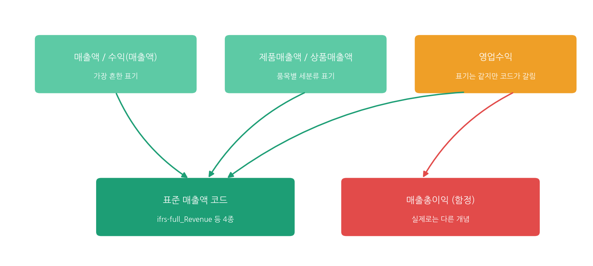
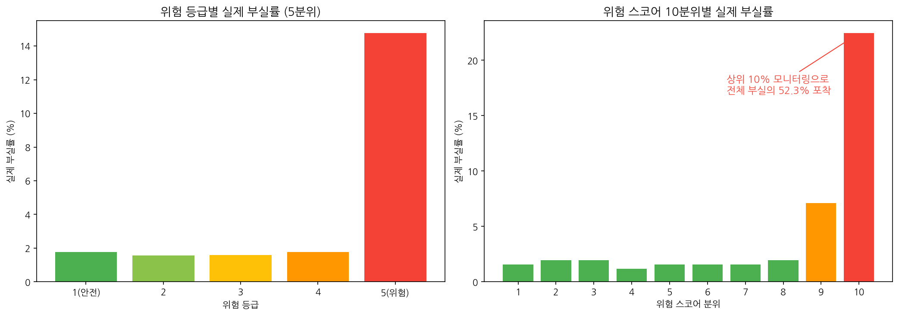

# FinStandard-EWS (Early Warning Scoring)

DART 기업정보 표준화 및 품질관리, 산업 상대지표 기반 부실위험 조기경보 파이프라인 (개인 프로젝트, 2026.08 ~ 2026.09)

**사용기술**: Python(pandas, scikit-learn), DART Open API(OpenDartReader), 공공데이터(KSIC 한국표준산업분류), Google Colab

## 프로젝트 개요

전자공시시스템(DART)의 대규모 기업 재무정보를 수집하고, 기업마다 제각각인 계정과목 표기를 표준화한 뒤, 산업별 상대지표를 반영해 기업의 부실위험을 스코어링합니다. 2024년 재무정보를 기준으로 이후 발생한 실제 관리종목 지정 및 상장폐지 사례와 대조하여 위험 스코어의 유효성을 검증했습니다.

## 1단계: 데이터 수집

- DART Open API로 상장 이력이 있는 3,988개 기업의 고유번호를 확보하고, 스팩 및 기업인수목적회사를 제외한 3,740개를 수집 대상으로 확정
- 2024 사업연도 재무제표(연결재무제표 우선, 없으면 별도재무제표로 대체 수집)와 기업개황(업종코드 포함)을 전량 수집
- API 호출 중 발생하는 세션 끊김에 대비해 50건 단위 체크포인트 저장 방식을 설계, 중단 후에도 이어서 진행 가능하도록 구현
- 최종적으로 2,663개 기업(전체 대상의 71.2퍼센트)의 재무제표를 확보. 나머지는 `modify_date`가 2017년 6월 이후 갱신되지 않아 사실상 활동이 종료된 기업으로 판단하고 제외

## 2단계: 계정과목 표준화 및 데이터 품질관리

- 매출액 하나만 놓고도 11가지 서로 다른 표기(매출액, 수익(매출액), 영업수익 등)가 발견됨
- 표준계정코드(account_id) 기준으로 재매핑한 결과, 실제로는 4개 표준코드로 정리됨을 확인
- 같은 영업수익이라는 이름이 기업에 따라 서로 다른 두 개념(매출액 대 매출총이익)을 가리키는 오분류 사례를 발견하고, 코드 기준 검증을 통해 이를 배제
- 조이시티처럼 매출원가 항목이 없는 업종 특성상 매출총이익 코드로 매출액을 대체 표기하는 경우를 fallback 규칙으로 별도 처리
- 완전자본잠식 기업(자본총계가 마이너스) 23개를 발견하고, 부채비율 계산 시 부호가 왜곡되는 문제를 별도 임계치 규칙으로 해결



## 3단계: 산업위험 반영 스코어링

- KSIC(한국표준산업분류) 중분류 기준으로 60개 업종에 업종명을 부여
- 부채비율, 유동비율, 영업이익률, 자기자본비율 4개 지표를 업종 평균 대비 상대지표로 재계산
- 절대 수치로는 안전해 보여도 업종 평균보다 높으면 위험하게, 절대 수치로는 위험해 보여도 업종 특성상 정상 범위면 상대적으로 안전하게 평가되도록 설계
- 4개 상대지표를 정규화하고 가중합하여 0에서 100점의 부실위험 스코어를 산출
- 완전자본잠식 기업은 다른 지표 계산과 무관하게 최고 위험등급(스코어 100)으로 강제 지정하는 임계치 규칙 적용

## 4단계: 실측 검증

- DART 거래소공시 134,514건(2024년 1월부터 현재까지)을 수집하고, 그중 실제 관리종목 지정 및 상장폐지 사유 발생 이력 184건을 식별
- 위험 스코어를 10분위로 나누어 각 구간의 실제 부실 전환율을 비교

| 위험 스코어 분위 | 실제 부실률 |
|---|---|
| 1에서 8분위 (하위 80퍼센트) | 1.2에서 2.0퍼센트 |
| 9분위 | 7.09퍼센트 |
| 10분위 (상위 10퍼센트) | 22.44퍼센트 |

- 상위 10퍼센트 기업의 실제 부실률은 하위 80퍼센트 대비 15배에서 19배 높음
- 상위 10퍼센트 위험군이 실제 부실 사례의 52.3퍼센트를 포함하는 것을 확인함



## 5단계: 업무 프로세스 개선안

수작업 기반의 사후 대응 방식(AS-IS)에서, 자동화된 파이프라인을 통한 사전 조기경보 방식(TO-BE)으로 전환하는 프로세스 개선안과 조기경보 리포트 양식을 설계했습니다. 자세한 내용은 [05_process_and_report_design.md](./05_process_and_report_design.md)에서 확인할 수 있습니다.

## 핵심 결과

위험 스코어 상위 10퍼센트 위험군이 실제 부실 사례의 52.3퍼센트를 포함하는 것을 실측 데이터로 확인했습니다.

## 폴더 구조

```
FinStandard-EWS/
├── FinStandard_EWS.ipynb
├── 05_process_and_report_design.md
├── risk_score_validation.png
├── account_standardization_mapping.png
└── README.md
```

## 향후 확장 방향

- 상장사 외 비상장 외감법인, 소상공인 재무정보까지 분석 범위 확장
- 다년도 재무제표 기반 시계열 추세 반영
- 이자보상배율 등 추가 재무비율 반영
- 재무제표 공시일 이후 발생한 부실 이벤트만 반영하도록 검증 기간 정교화
- 업종 상대화 적용 전후 스코어의 예측력을 정량 비교하는 베이스라인 검증 추가
