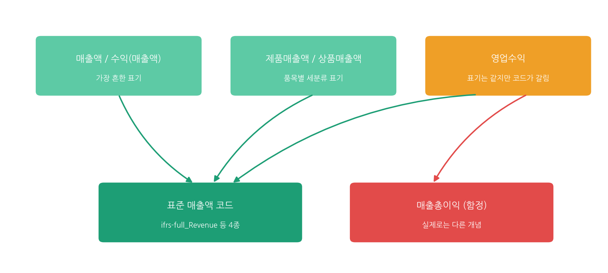
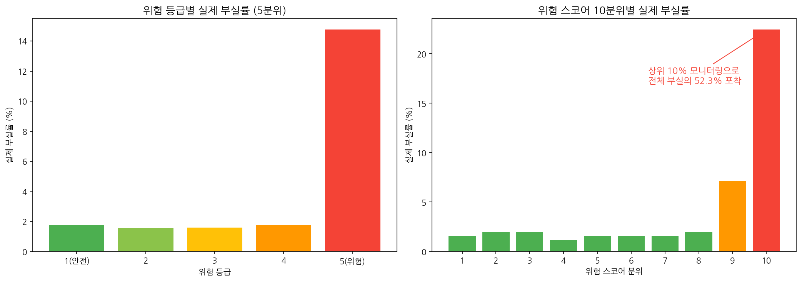

# FinStandard-EWS (Early Warning Scoring)

DART 기업정보 표준화 및 품질관리, 산업 상대지표 기반 부실위험 조기경보 파이프라인 (개인 프로젝트, 2026.09)

**사용기술**: Python(pandas, scikit-learn), DART Open API(OpenDartReader), 공공데이터(KSIC 한국표준산업분류), Google Colab

## 프로젝트 개요

전자공시시스템(DART)의 대규모 기업 재무정보를 수집하고, 기업마다 제각각인 계정과목 표기를 표준화한 뒤, 산업별 상대지표를 반영해 기업의 부실위험을 스코어링합니다. 2024년 재무정보를 기준으로 실제 관리종목 지정 및 상장폐지 사례와 대조해 위험 스코어의 유효성을 검증했고, **재무제표 공시 이후 발생한 부실만 남기고 완전자본잠식 기업을 제외한 엄격한 조건에서도 성과가 유지되는지 재검증**했습니다.

## 1단계: 데이터 수집

- DART Open API로 상장 이력이 있는 3,988개 기업의 고유번호를 확보하고, 스팩 및 기업인수목적회사를 제외한 3,740개를 수집 대상으로 확정
- 2024 사업연도 재무제표(연결재무제표 우선, 없으면 별도재무제표로 대체 수집)와 기업개황(업종코드 포함)을 전량 수집
- API 호출 중 발생하는 세션 끊김에 대비해 50건 단위 체크포인트 저장 방식을 설계, 중단 후에도 이어서 진행 가능하도록 구현
- 최종적으로 2,663개 기업(전체 대상의 71.2%)의 재무제표를 확보. 나머지는 `modify_date`가 2017년 6월 이후 갱신되지 않아 사실상 활동이 종료된 기업으로 판단하고 제외

## 2단계: 계정과목 표준화 및 데이터 품질관리

- 매출액 하나만 놓고도 11가지 서로 다른 표기(매출액, 수익(매출액), 영업수익 등)가 발견됨
- 표준계정코드(`account_id`) 기준으로 재매핑한 결과, 실제 매출액은 4개 표준코드로 정리됨을 확인
- 같은 '영업수익'이라는 이름이 기업에 따라 서로 다른 두 개념(매출액 대 매출총이익)을 가리키는 사례를 발견. 매출총이익을 매출로 쓰면 영업이익률이 부풀려지므로 코드 기준으로 매출을 정의
- 조이시티처럼 매출원가 항목이 없는 업종 특성상 매출총이익 코드로 매출액을 공시하는 경우를 fallback 규칙으로 별도 처리
- 완전자본잠식 기업(자본총계 < 0) 23개를 발견. 부채비율이 음수로 계산되어 오히려 가장 안전해 보이는 부호 왜곡 문제를 별도 임계치 규칙으로 해결



## 3단계: 산업위험 반영 스코어링

- KSIC(한국표준산업분류) 중분류 기준으로 60개 업종에 업종명을 부여
- 부채비율, 유동비율, 영업이익률, 자기자본비율 4개 지표를 업종 평균 대비 상대지표로 재계산 (영업이익률은 업종 평균이 0에 가까울 때 배율이 폭주하므로 차이(%p)로 계산)
- 예: 부채비율 796%인 비금속광물 기업은 업종 평균의 2.1배, 476%인 자동차부품 기업은 업종 평균의 약 3배 → 절대 수치와 업종 내 위험 순서가 뒤바뀜
- 4개 상대지표를 정규화하고 동일 가중 평균하여 0~100점의 부실위험 스코어를 산출
- 완전자본잠식 기업은 다른 지표와 무관하게 최고 위험(스코어 100)으로 지정

## 4단계: 실측 검증

### 부실 라벨 정의

- DART 거래소공시 134,514건(2024.01 ~ 2026.09)을 수집
- 관리종목 지정, 상장폐지 사유 발생, 상장폐지 결정만 부실로 정의하고, 해제·해소·우려 예고·이의신청·가처분·이전상장(코스닥→코스피)은 제외
- 부실 공시 273건, 고유 부실 기업 184개 식별 (이 중 스코어 산출 대상 2,539개사와 겹치는 기업은 109개)

### 1차 검증 (전체 기간)

| 위험 스코어 분위 | 실제 부실률 |
| --- | --- |
| 1~8분위 (하위 80%) | 1.18% ~ 1.97% |
| 9분위 | 7.09% |
| 10분위 (상위 10%) | 22.44% |

- 상위 10% 부실률 22.44%, 나머지 90%는 2.28%
- 전체 부실 기업 109개 중 57개(52.3%)가 상위 10%에 포함

### 2차 재검증 (엄격한 조건)

1차 검증에는 두 가지 한계가 있었습니다.

1. **시점 문제**: 2024년 재무제표는 2025년 3월경 공시되는데, 부실 공시는 2024년 1월부터 집계해 재무제표보다 먼저 발생한 부실도 정답에 포함됨
2. **순환 문제**: 완전자본잠식은 그 자체로 관리종목·상장폐지 사유이므로, 이를 최고 위험으로 지정한 규칙이 성과를 부풀렸을 수 있음

이를 확인하기 위해 조건을 바꿔 다시 검증했습니다.

- **A**: 2025.04.01 이후 발생한 부실만 정답으로 사용, 그 이전에 이미 부실 공시가 있던 기업은 평가에서 제외
- **B**: A에서 완전자본잠식 기업까지 제외

| 조건 | 평가 기업 | 부실 기업 | 상위 10% 부실률 | 나머지 90% 부실률 | 상위 10% 포착률 |
| --- | --- | --- | --- | --- | --- |
| 1차 검증 (전체 기간) | 2,539 | 109 | 22.44% | 2.28% | 52.3% (57/109) |
| A. 공시 이후 부실만 | 2,468 | 38 | 8.50% | 0.77% | 55.3% (21/38) |
| **B. A + 완전자본잠식 제외** | **2,456** | **36** | **8.13%** | **0.72%** | **55.6% (20/36)** |

- 가장 엄격한 조건(B)에서도 상위 10%의 부실률은 나머지 90%보다 약 11배 높고, 부실 기업의 55.6%가 상위 10%에 포함됨
- 1차 대비 부실률 수치가 낮아진 것은 이미 알려진 부실이 정답에서 빠지며 전체 부실률이 4.29%에서 1.47%로 내려갔기 때문이며, 상위 10%와 나머지의 격차는 유지됨



### 검증의 한계

- B 조건의 부실 기업이 36개로 표본이 작아 결과의 변동 가능성이 있음
- 2024 사업연도 1개년 재무제표만 사용

## 5단계: 업무 프로세스 개선안

수작업 기반의 사후 대응 방식(AS-IS)에서, 자동화된 파이프라인을 통한 사전 조기경보 방식(TO-BE)으로 전환하는 프로세스 개선안과 조기경보 리포트 양식을 설계했습니다. 자세한 내용은 [05_process_and_report_design.md](05_process_and_report_design.md)에서 확인할 수 있습니다.

## 핵심 결과

재무제표 공시 이후 발생한 부실만 남기고 완전자본잠식 기업을 제외한 조건에서도, 위험 스코어 상위 10%의 부실률(8.13%)은 나머지 90%(0.72%)의 약 11배였으며 부실 기업의 55.6%가 상위 10%에 포함되었습니다.

## 폴더 구조

```
FinStandard-EWS/
├── FinStandard_EWS.ipynb
├── 05_process_and_report_design.md
├── risk_score_validation.png
├── account_standardization_mapping.png
└── README.md
```

## 향후 확장 방향

- 다년도 재무제표를 사용해 부실 표본을 늘리고 시계열 추세 반영
- 상장사 외 비상장 외감법인, 소상공인 재무정보까지 분석 범위 확장
- 이자보상배율, 영업현금흐름 등 상환 능력 지표 추가
- 업종 상대화 적용 전후 스코어의 예측력을 정량 비교하는 베이스라인 검증 추가
